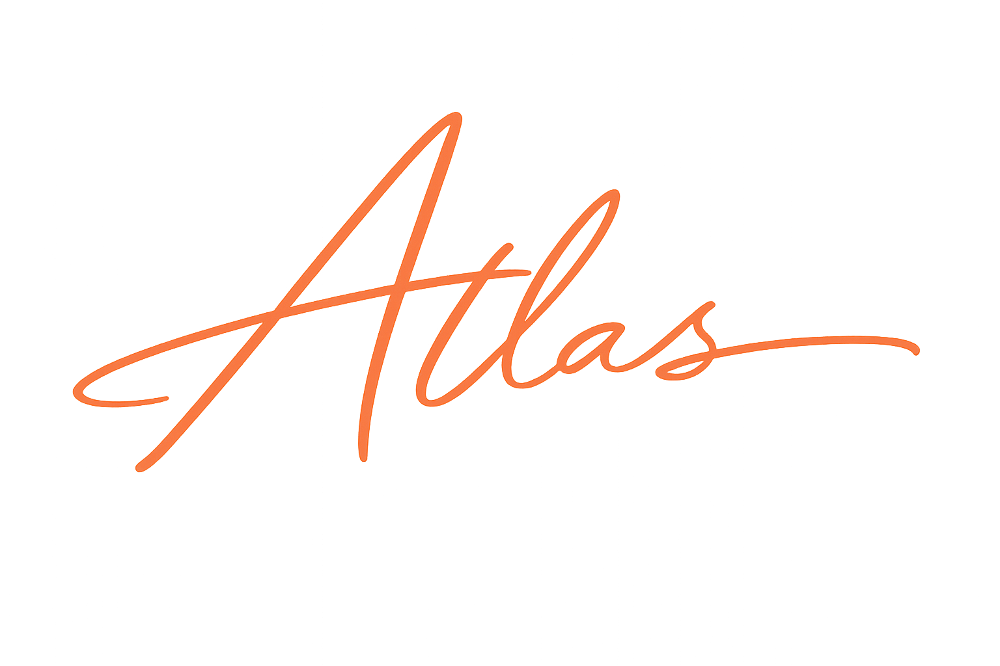
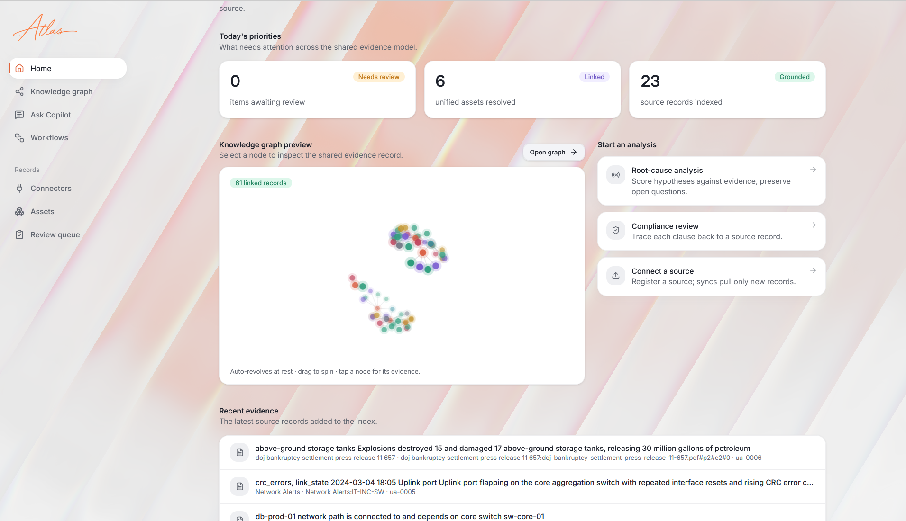
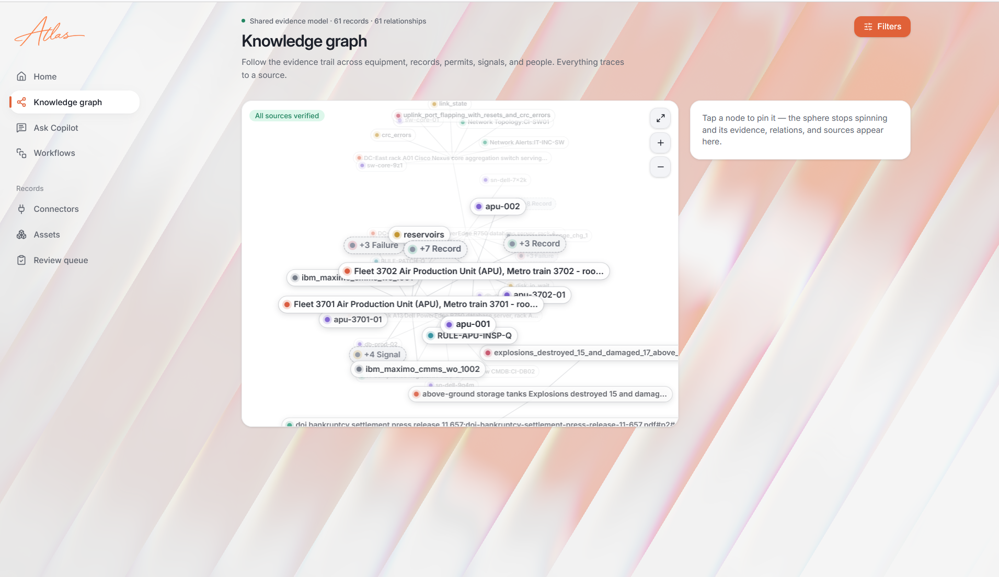
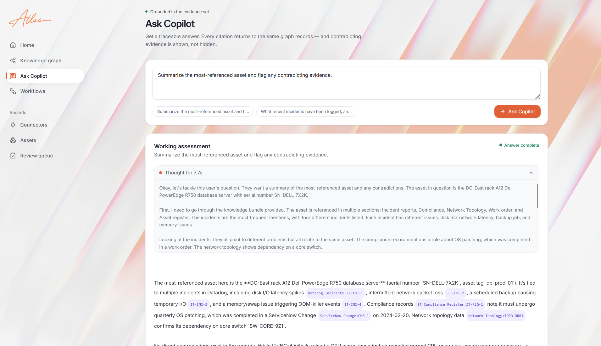
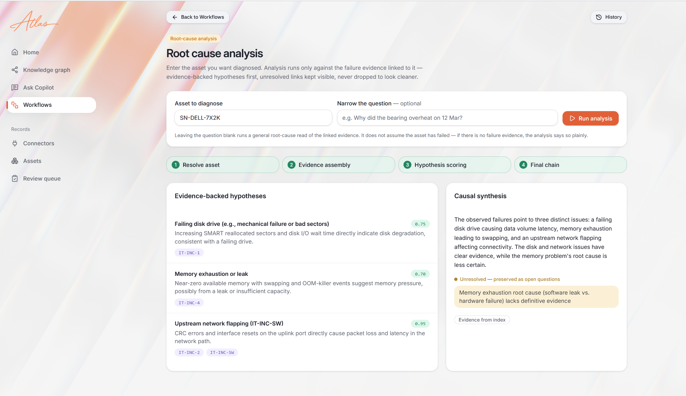
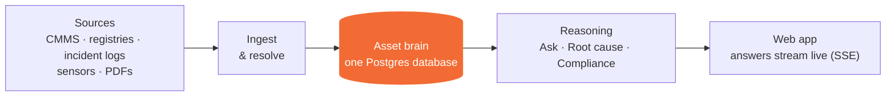

<div align="center">



# Atlas — Unified Asset Intelligence

**Turn siloed operational data (CMMS, incident logs, registries, compliance
records, and PDFs) into one grounded knowledge graph — then ask it questions,
diagnose root causes, and check compliance, with every answer traced to a
source.**

</div>

---

## The problem

The same physical asset shows up in a dozen systems under a dozen different
names — a serial here, an asset tag there, a hostname somewhere else — with **no
shared key**. So "what do we actually know about this pump / server / line?"
has no answer, and root-cause and compliance questions turn into manual
archaeology.

**Atlas resolves every source record to one canonical asset, extracts what
happened to it, and reasons over the result — grounded in citations, never
guessing.**

## What it does

- **Entity resolution / canonicalization** — stitches the same asset across
  sources using shared identifiers (validated against real ID standards) plus
  embedding similarity, with a confidence formula and a human review queue for
  weak matches.
- **Generalized ingestion** — structured connectors (JSON/API) *and* PDFs via
  [Docling](https://github.com/docling-project/docling), with a durable
  **chain-of-custody** (a parse is stored before anything else, so a source is
  never lost) and low-memory handling for large reports.
- **Knowledge graph** — a single Postgres `edges` table (physical + operational
  layers) walked with recursive SQL, visualized as a revolving 3D sphere.
- **OKF asset documents** — every asset is projected into a readable document
  where **every claim cites its source record**.
- **Ask Copilot** — a hardened intent router (grounded Q&A, asset lookup, RCA,
  compliance, overview) that resists off-topic questions and prompt injection,
  and asks a clarifying question only when genuinely unsure. Reasoning streams
  separately from the answer.
- **Root-cause analysis** — reasons only when failure evidence exists, follows
  dependencies for **multi-hop** causes, and **calibrates confidence to the
  evidence** (never asserts certainty from thin data).
- **Compliance** — the at-risk list is a deterministic graph query, not a guess.

## Screenshots

| Home | Knowledge graph |
|---|---|
|  |  |

| Ask Copilot | Root-cause analysis |
|---|---|
|  |  |

## Architecture



- **One database.** PostgreSQL + `pgvector` does identity, vector search, *and*
  the graph (recursive CTEs). No Neo4j, no Qdrant — a single source of truth.
- **One backend.** Async FastAPI; every long action streams status over SSE.
- **One web app.** Vite + React + TypeScript + Tailwind + shadcn/ui.

A full, layer-by-layer walkthrough (with diagrams) lives in
**[`docs/architecture/`](docs/architecture/)** — start at
[`01-system-overview.md`](docs/architecture/01-system-overview.md).

## Tech stack

| Layer | Choice |
|---|---|
| Database | Supabase (PostgreSQL + `pgvector`); graph via recursive CTEs |
| Backend | Python 3.13, FastAPI (async), Server-Sent Events |
| LLM / embeddings / rerank | NVIDIA NIM (Nemotron) via `langchain-nvidia-ai-endpoints` |
| Orchestration | LangChain + LangGraph (RCA, compliance, chat) |
| Document parsing | Docling (PDF → structured), pypdfium2 fallback |
| Frontend | Vite + React + TypeScript, Tailwind CSS, shadcn/ui |

## Getting started

**Prerequisites:** Docker Desktop, Python 3.13, Node 18+, and an
[NVIDIA NIM API key](https://build.nvidia.com).

**1. Supabase (Postgres + pgvector)** — bring up the self-hosted stack per the
[Supabase self-hosting guide](https://supabase.com/docs/guides/self-hosting/docker)
so Postgres is reachable locally, and enable the `vector` extension.

**2. Backend**
```bash
cd backend
py -3.13 -m venv .venv
.venv\Scripts\python.exe -m pip install -r requirements.txt
copy .env.example .env          # then fill in your keys (see below)
.venv\Scripts\python.exe -m uvicorn app.main:app --host 127.0.0.1 --port 8001
```

**3. Frontend**
```bash
cd frontend
npm install
copy .env.example .env          # VITE_API_URL=http://localhost:8001
npm run dev                     # http://localhost:5173
```

**Environment** — copy `backend/.env.example` → `backend/.env` and
`frontend/.env.example` → `frontend/.env`, then fill in your NVIDIA key,
Supabase key, and `DATABASE_URL`. In production only `DATABASE_URL` changes
(point it at hosted Supabase) — the code is identical.

> Secrets live only in `.env` files, which are git-ignored. Never commit them.

## Demo

A ready-made, two-industry demo corpus (a manufacturing pump + an IT
datacenter) shows resolution, anomaly gating, single-asset and **multi-hop**
RCA, and compliance.

- Reset everything: `demo\reset.bat --reset-only`
- Then add the connectors in [`demo/connectors/`](demo/connectors/) from the UI
  (Connectors → add each JSON as a `manual` connector, then Sync), or seed them
  in one shot: `demo\reset.bat`.
- Follow the presenter walkthrough in
  **[`demo/DEMO_SCRIPT.md`](demo/DEMO_SCRIPT.md)** — it lists exactly what to
  click, what to ask, and what the system should respond.

## Evaluation

`backend/eval_suite.py` is an **honest** harness: it grades resolution F1,
anomaly gating, answer **grounding** (does every cited hypothesis reference
evidence that actually exists?), confidence **calibration**, cross-asset
leakage, and compliance determinism — not keyword matching. Run it with the
backend up:
```bash
cd backend
.venv\Scripts\python.exe eval_suite.py
```

## Repository layout

```
backend/    FastAPI service — ingestion, resolution, graph, workflows, eval
frontend/   Vite + React + TS single-page app
demo/       Demo connectors (JSON), reset script, and the demo walkthrough
docs/       Architecture diagrams (mermaid) + screenshots
```

## License

[MIT](LICENSE)
