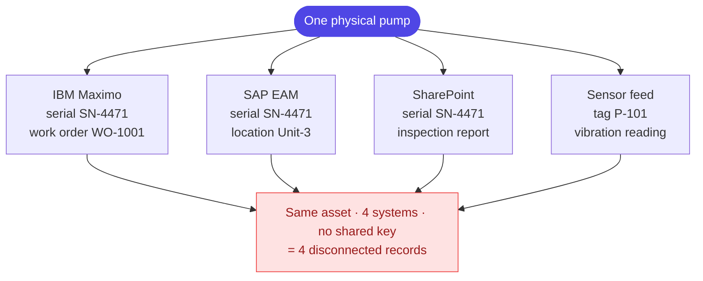

# Layer 0 - The problem

One real machine shows up in many systems. They agree on a serial number but each
carries different extra fields, and nothing joins them. So no one record can answer
"what is this asset, and what has happened to it?"

Peel inward from here: [01 system overview](01-system-overview.md).
