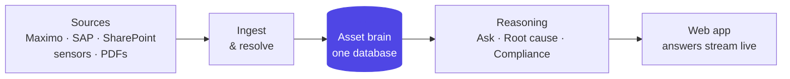

# Layer 1 - System overview

The whole system in one line: pull records in, resolve them into one asset each,
keep everything in a single database, then reason over it and stream answers to the
web app.

## What lives where
- **Database:** one PostgreSQL instance. The knowledge graph is a table of edges,
  walked with recursive SQL. No separate graph or vector database.
- **Backend:** one asynchronous FastAPI service.
- **Web app:** a single-page React app; every long action streams status instead of
  spinning.

## The layers to peel (this deck's order)
`02` ingest → `03` chain-of-custody → `04` schema discovery → `05` resolution +
confidence → `06` knowledge graph → `07` OKF → `08` retrieval → `09` Ask copilot →
`10` root cause → `11` compliance → `12` data model → `13` end-to-end.
