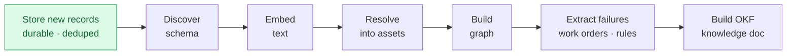

# Layer 2 - Ingestion

Every sync does two things: store only what is new, then rebuild the whole picture
from everything stored so far. One source is never overwritten by another.

## Two properties that matter
- **Incremental** - a record is stored once, keyed by source + record id. Re-syncing
  adds nothing.
- **Accumulative** - after the new batch lands, the full corpus is re-resolved, so
  the asset picture only grows.

Only records without an embedding are sent to the embedding model, which keeps the
request budget small.

Next, why the very first step is drawn apart: [03 chain-of-custody](03-chain-of-custody.md).
