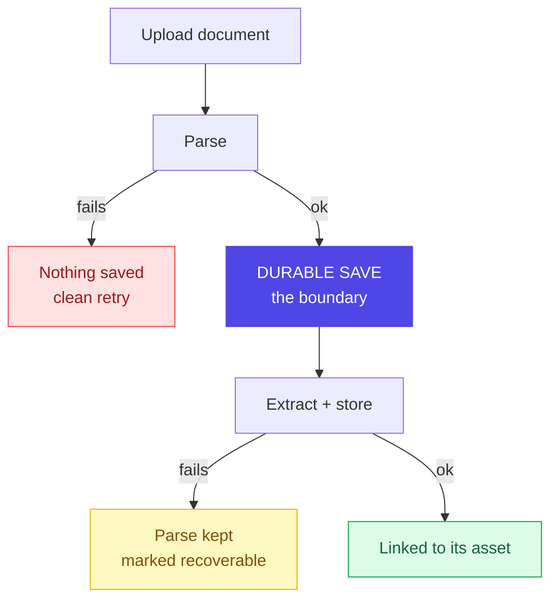

# Layer 3 - Chain-of-custody (documents)

An uploaded document can never be silently lost. One save is the dividing line:
fail before it and nothing is written; fail after it and the parse is kept and
marked recoverable.

Both failure paths are covered by explicit tests, so the two cases are provably
distinct rather than merely claimed.

**Tool used here - Docling:** an open-source document parser from IBM Research (now
under the Linux Foundation's LF AI & Data), built to get documents "ready for gen
AI". It reads a PDF's real structure - reading order, headings, tables - before any
model sees it, so structure is extracted, not guessed. OCR is available for scanned
pages but kept off here (digital PDFs). Layout parsing is memory-heavy, so it runs a
page at a time with images off; oversized or image-only PDFs fall back to a
lightweight text-only extractor.

Next: how fields are understood - [04 schema discovery](04-schema-discovery.md).
