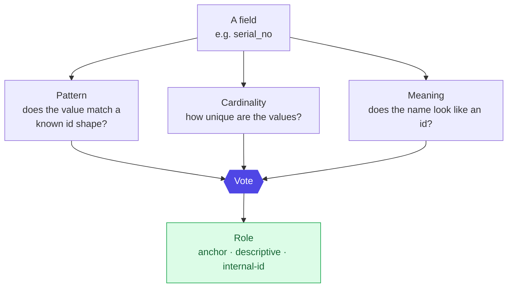

# Layer 4 - Schema discovery

Before merging anything, the system has to know which columns are trustworthy
identity. It never hardcodes column names; instead each field earns a role from
three independent votes.

## Why three votes
Any one signal is fooled easily - a sequential internal counter looks unique
(cardinality) but is worthless for identity. Requiring agreement across pattern,
uniqueness, and name catches those traps.

Not every id is equal. Each identity type carries a fixed, physics-based weight -
how strongly a match implies "same object":

`serial 0.95 · MAC 0.90 · UUID 0.85 · asset tag 0.60`

Those weights feed straight into the merge math next:
[05 resolution + confidence](05-resolution-confidence.md).
