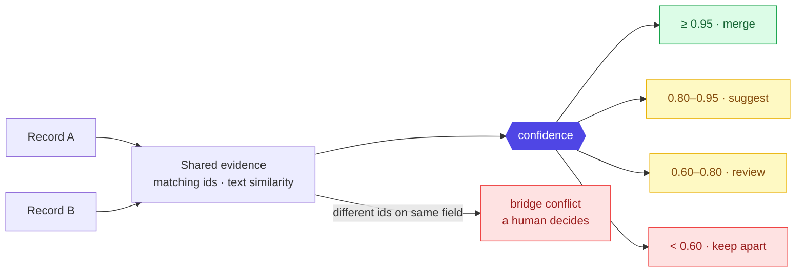

# Layer 5 - Resolution + confidence

Two records are compared on shared evidence, scored, and either merged, queued for
a human, or kept apart. This is the step that collapses the four disconnected
records from Layer 0 into one asset.



## The confidence formula (exact, from code)

```
confidence = base × redundancy × conflict_penalty        (capped at 1.0)
```

- **base** - the strongest single piece of evidence
  (serial 0.95, MAC 0.90, UUID 0.85; or the text-similarity score itself).
- **redundancy** - reward for independent agreement:
  `1 signal → 1.00 · 2 → 1.05 · 3+ → 1.08`, plus `+0.03` when an exact id match
  and text similarity both agree.
- **conflict_penalty** - punish contradictions:
  `none → 1.00 · medium id clash → 0.80 · strong id clash → 0.40`.

## Why it behaves well
Merges run strongest-evidence-first. A merge that would put two different strong
ids (say two serials) in one asset is blocked and raised for review, not quietly
forced. Human decisions always override the score.

**Method used - union-find, strongest-edge-first:** a standard way to grow groups
by joining the most confident links first, so weak or conflicting links never drag
unrelated records together.

Next, where merged assets are placed: [06 knowledge graph](06-knowledge-graph.md).
