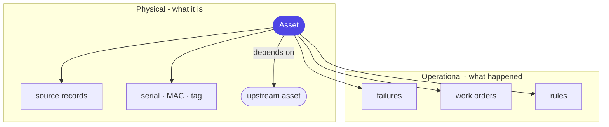

# Layer 6 - Knowledge graph

Each asset sits at the centre of two layers of links: what it *is* (physical) and
what has *happened* to it (operational). Both live in one table of edges.

## Why one table, not a graph database
The queries needed here are shallow and fixed - trace a failure a few hops, or find
assets missing a required work order. PostgreSQL walks those with a self-referencing
query, so the graph stays in the one database with everything else.

**Term - recursive query (recursive CTE):** a SQL query that refers back to itself
to follow links step by step. It gives graph-style traversal without a second
database to run and sync.

One guard worth noting: a routine record (a normal reading, a completed backup) is
*not* turned into a failure. Only genuine anomalies become failure links.

Next, how an asset is written up for people and search: [07 OKF](07-okf.md).
