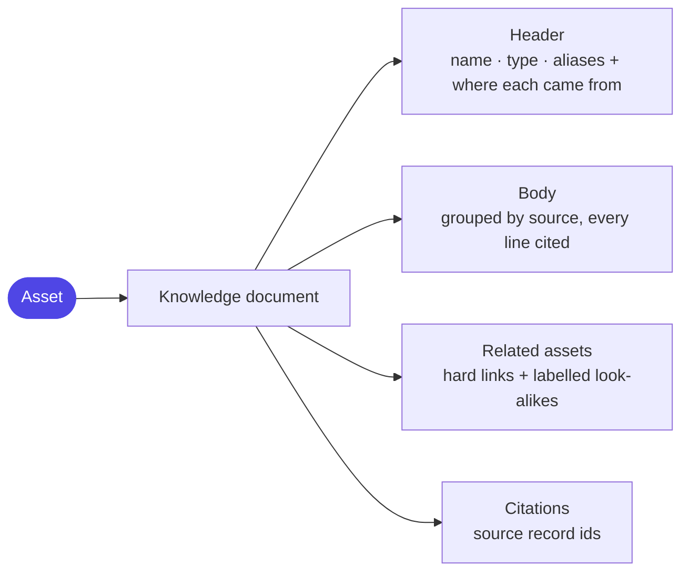

# Layer 7 - OKF (the asset's knowledge document)

Every asset is written out as a single readable document that gathers everything
known about it, with each claim traced to its source. This is what a person reads in
the inspector and what search runs against.

**What OKF stands for - Open Knowledge Format:** a simple convention (a markdown
file with a small structured header) that originated as a public specification for
sharing knowledge between tools. Here it is used only as a readable, portable *view*
built on demand from the database - not as a second place data is stored.

Why it helps: the same document serves three readers at once - a person in the UI, a
retrieval step that searches it, and an audit trail that shows where each fact came
from.

Next, how questions find the right evidence: [08 retrieval](08-retrieval-rag.md).
