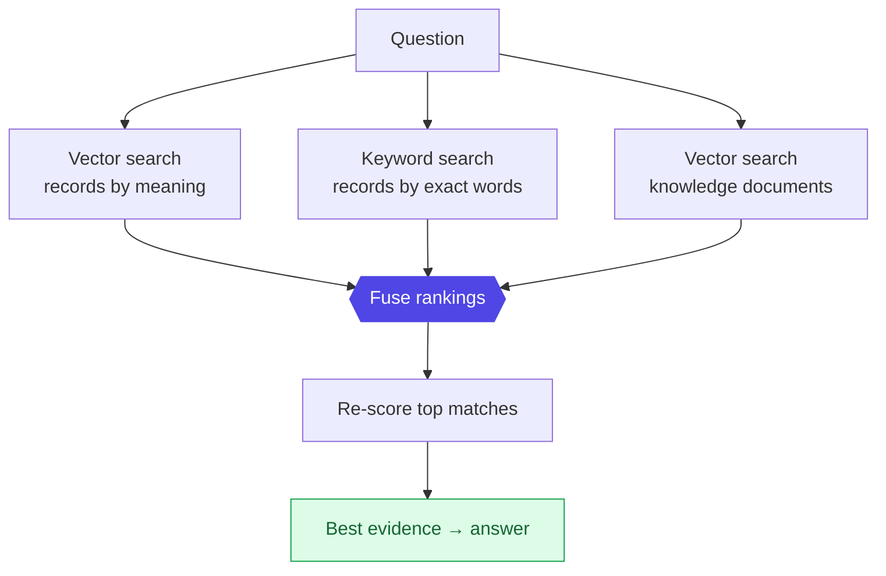

# Layer 8 - Retrieval

A question is answered from evidence, not memory. Three searches run in parallel,
their rankings are fused, and the top matches are re-scored before anything reaches
the model.

## Why three searches, then two more steps
Meaning-search finds paraphrases; keyword-search catches exact ids and codes;
searching the knowledge documents pulls in already-consolidated context. Combining
all three recovers matches any single method misses.

- **Fusing rankings (Reciprocal Rank Fusion):** a method that blends several ranked
  lists by rank position, so no list needs a hand-tuned weight.
- **Re-scoring (cross-encoder rerank):** a model that reads the question and a
  candidate together and judges the pair directly - slower, so it runs only on the
  short list, buying precision at the top.

Both **vector search** (meaning) and **keyword search** (exact words) run inside the
same PostgreSQL instance - vectors via its `pgvector` extension, keywords via its
built-in full-text index.

Next, how a user actually asks: [09 Ask copilot](09-ask-copilot.md).
