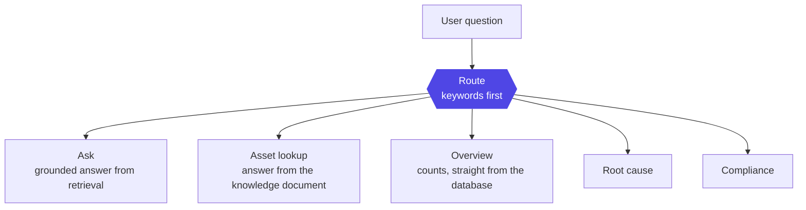

# Layer 9 - Ask copilot

The chat is a router, not a free-roaming agent. A question is sorted to one handler,
so every answer is grounded and the number of model calls per turn stays fixed.

## Why a router
A free agent can wander, call tools unpredictably, and invent. Fixing the routes
keeps answers traceable and cost bounded. Simple counts never touch a model at all.

Two things are computed rather than asked of the model, so they can't be
hallucinated: the **confidence** of an answer and any **contradicting evidence**,
which is always surfaced, never hidden.

The answer streams as it is written, and the model's reasoning streams separately
from its final wording - so the UI can show a "thinking" trace above a clean answer,
with a stop button.

**How this is wired - LangGraph:** a library for laying out LLM steps as an explicit
graph of stages. It is used so the route and each handler are inspectable and
testable, instead of one opaque prompt.

Two routes deserve their own view: [10 root cause](10-rca.md) and
[11 compliance](11-compliance.md).
