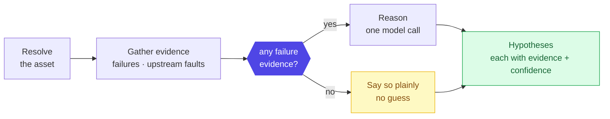

# Layer 10 - Root-cause analysis

Four stages. Evidence is gathered from the graph first; the model reasons only when
real failure evidence exists, so it can never invent a cause for a healthy asset.

## Why the gate
No failures on record means there is nothing to diagnose. The gate stops the model
from producing a confident-sounding story with no basis.

**Multi-hop:** assets can declare what they depend on, so a symptom on one asset can
be traced to a fault on the thing upstream of it - for example a downstream outage
attributed to a flapping upstream network port. The reasoning cites that upstream
record.

Every hypothesis names the evidence it rests on; contradictions and open questions
are listed rather than smoothed over.

Sibling workflow: [11 compliance](11-compliance.md).
