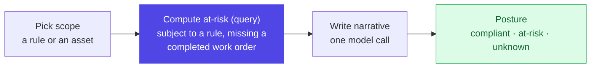

# Layer 11 - Compliance

Same shape as root cause, with one deliberate difference: the at-risk list is
computed by a database query and is the source of truth. The model only writes the
summary around it.

## Why the list is not model-generated
"Which assets are at risk" is an audit answer - it must be exact and repeatable. So
it comes from a query (assets bound to a rule that lack a completed work order), and
the UI labels it as computed from records. The model contributes wording, never the
verdict. If there is no rule evidence, the model step is skipped.

Next, the tables all of this rests on: [12 data model](12-data-model.md).
