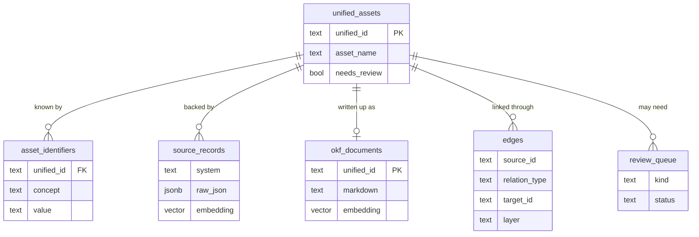

# Layer 12 - Data model (core tables)

The shape underneath everything, trimmed to the tables that carry the story. All of
it is one PostgreSQL database.

## Reading it
- `source_records` is durable ground truth - raw input, never overwritten. Its
  `embedding` powers meaning-search.
- `unified_assets` + `asset_identifiers` are the resolved result: one asset, many
  ids from many systems.
- `edges` is the whole knowledge graph, split by `layer` into physical vs
  operational.
- `okf_documents` is the built knowledge view per asset, searchable on its own.
- `review_queue` is the human-in-the-loop backlog.

**Extension used - `pgvector`:** adds a vector column type and similarity search to
PostgreSQL, so embeddings live beside the records instead of in a separate service.

Finally, the two flows tied together: [13 end-to-end](13-end-to-end.md).
