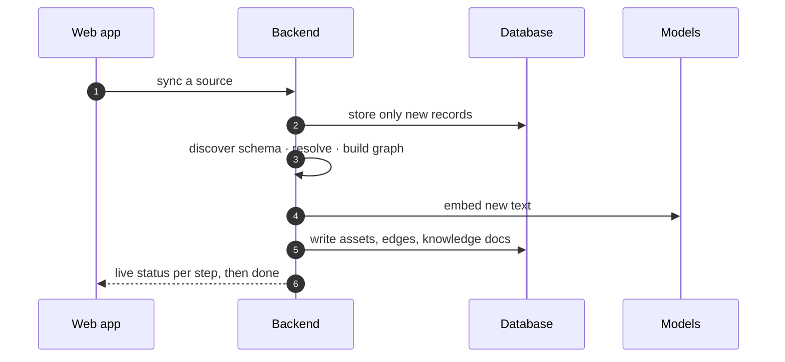
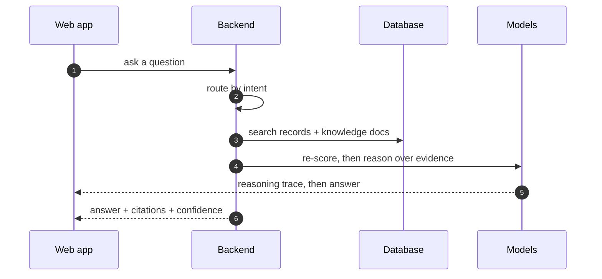

# Layer 13 - End-to-end

Two flows connect every layer above: getting data in, and getting an answer out.
Both stream their progress to the user.

## Getting data in

## Getting an answer out

**How the live updates travel - Server-Sent Events (SSE):** a plain one-way stream
over ordinary HTTP where the server pushes messages as they happen. It is used so
each step's status and each token of the answer appear immediately, with no polling
and no two-way socket to manage.

Perceived speed comes from streaming: the user sees the first words almost at once
rather than waiting for the whole answer.
