# Atlas - Unified Asset Brain
### A descriptive walkthrough of the problem, the architecture, and how each part works

This document is built to be read once, top to bottom, and understood. It starts
with the whole system, then peels one layer at a time. Diagrams carry the story;
text is kept short. Each new tool is named in full and explained only where it is
first used. Worked examples use the system's real data.

Legend used below:
- **Worked example** - a concrete case on real records.
- **Why this way** - the motivation behind a design choice.
- **New here** - a tool or method introduced at the layer that uses it.

---

## Layer 0 - The problem

One physical machine appears in several systems. They agree on a serial number but
each carries different extra fields, and nothing joins them. No single record can
say what the asset is or what has happened to it.

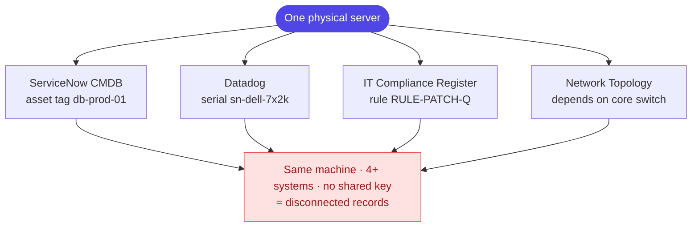

> **Worked example.** In the loaded dataset this is asset `ua-0003`, a DC-East Dell
> PowerEdge R750 database server. It shows up as `db-prod-01` (ServiceNow CMDB),
> `sn-dell-7x2k` (Datadog), and again in the IT Compliance Register, Network
> Topology, and ServiceNow Change - five records, one machine, no common key.

---

## Layer 1 - The system in one view

Pull records in, resolve each to one asset, keep everything in a single database,
reason over it, and stream answers. There is no separate graph or vector engine.

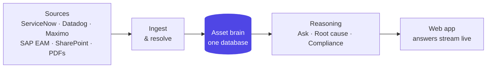

> **Facts.** The demo corpus is 23 source records from several connectors -
> ServiceNow CMDB, Datadog Incidents, ServiceNow Change, IT Compliance Register,
> Metro Asset Registry, IBM Maximo CMMS, plus network and document sources - resolved
> into 6 unified assets. The knowledge graph view spans 61 nodes and 61 relationships.

The rest of this document peels the layers inside this picture, in order.

---

## Layer 2 - Ingestion

Every sync stores only what is new, then rebuilds the whole picture from everything
stored so far. One source never overwrites another.

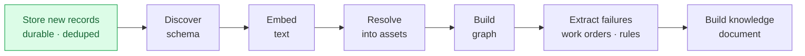

- **Incremental** - a record is stored once, keyed by source + record id; re-syncing
  adds nothing.
- **Accumulative** - after the new batch lands, the full corpus is re-resolved, so
  the asset picture only grows.

> **Why this way.** Sources arrive at different times and overlap. Re-resolving the
> whole corpus each sync means a late-arriving record can complete or correct an
> earlier merge, and no source is ever clobbered by another. Only records without a
> stored vector are re-embedded, which keeps the model budget small.

---

## Layer 3 - Chain-of-custody for documents

An uploaded document can never be silently lost. Ingestion runs as a background job
you can watch live and cancel; whatever happens, one save is the dividing line.

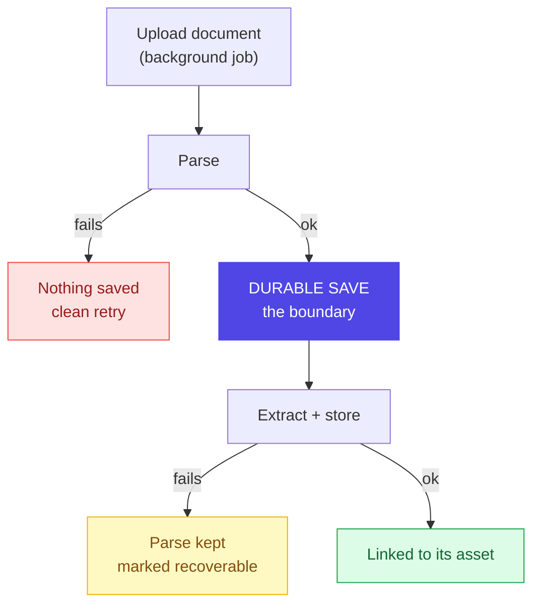

- **Fail before the save** - nothing is persisted; a retry starts clean.
- **Fail after the save** - the parse is kept and marked recoverable, not lost.

Both failure paths are covered by explicit tests, and re-running a document only
reprocesses one that never finished.

> **New here - Docling.** An open-source document parser from IBM Research, now
> hosted under the Linux Foundation's LF AI & Data; its stated purpose is to get
> documents "ready for gen AI". It reads a PDF's real structure - reading order,
> headings, tables - into a clean, machine-usable form, with OCR available for
> scanned pages (kept off here, since these are digital PDFs). Parsing happens before
> any model, so structure is extracted, not guessed.

> **Why the guardrails.** Layout parsing is memory-heavy, so it runs one page at a
> time with images off and fast table detection; very large or image-only PDFs fall
> back to a lightweight text-only extractor rather than risk the process. The full
> parse is the durable artifact saved at the boundary above.

---

## Layer 4 - Schema discovery

Before merging anything, the system decides which columns are trustworthy identity.
It never hardcodes column names; each field earns a role from three independent
votes.

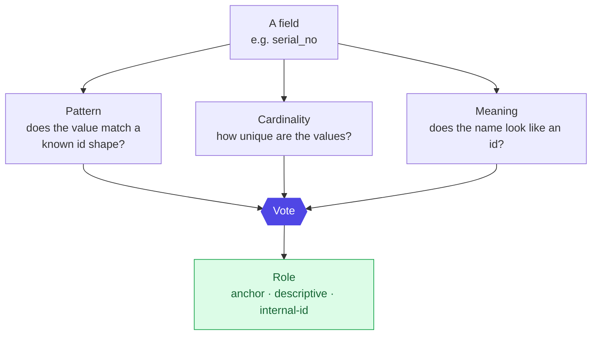

Each identity type carries a fixed, physics-based weight - how strongly a match
implies "same object": `serial 0.95 · MAC 0.90 · UUID 0.85 · asset tag 0.60`.

> **Worked example - the trap it avoids.** A sequential internal counter (for
> instance SAP's equipment number) looks perfectly unique, so cardinality alone would
> trust it. But its values are just row numbers, not identity. Because pattern and
> name disagree, the vote marks it an internal id and never merges on it.

---

## Layer 5 - Resolution and the confidence score

Two records are compared on shared evidence, scored, then merged, queued for a
human, or kept apart. This is the step that collapses the five `ua-0003` records
into one asset.

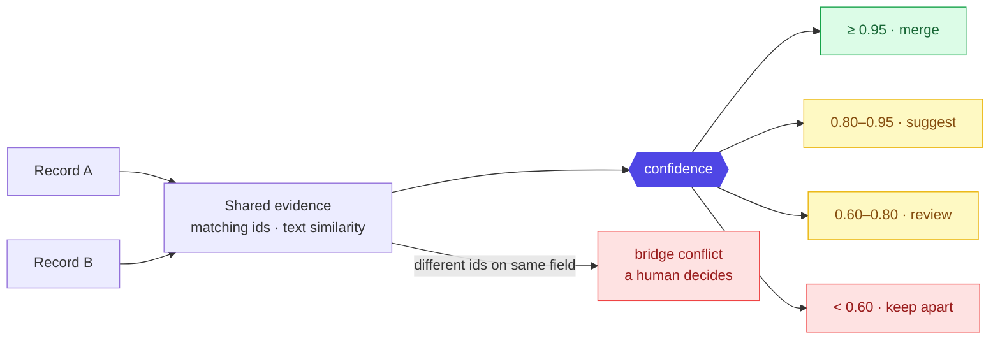

The score is explainable and fixed:

```
confidence = base × redundancy × conflict_penalty        (capped at 1.0)
```

- **base** - the strongest single piece of evidence (an id's weight, or the
  text-similarity score).
- **redundancy** - reward for independent agreement:
  `1 signal → 1.00 · 2 → 1.05 · 3+ → 1.08`, plus `+0.03` when an exact id and text
  both agree.
- **conflict_penalty** - punish contradiction:
  `none → 1.00 · medium id clash → 0.80 · strong id clash → 0.40`.

> **Worked example - a merge.** The ServiceNow and Datadog records for the database
> server share the serial `sn-dell-7x2k` (weight 0.95); their text also agrees.
> `0.95 × 1.08 × 1.00 = 1.03 → capped 1.0`, well past the 0.95 line, so they
> auto-merge into `ua-0003`.
>
> **Worked example - a block.** If two records shared one id but listed two different
> serials, the strong clash applies: `0.95 × … × 0.40 < 0.60`. The merge is blocked
> and raised for human review instead of being forced silently.

> **New here - union-find (strongest-edge-first).** A standard way to grow groups by
> joining the most confident links first. It means a weak or conflicting link can
> never drag unrelated records together. Human decisions are recorded and always
> override the score.

---

## Layer 6 - The knowledge graph

Each asset sits between two layers of links: what it *is* (physical) and what has
*happened* to it (operational). Both live in one table of edges.

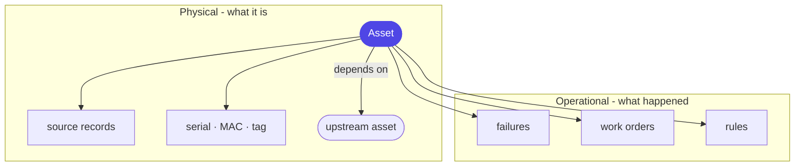

> **New here - recursive query (recursive CTE).** A SQL query that refers back to
> itself to follow links step by step, with a cycle guard and a depth limit. It gives
> graph-style traversal without running a second, separate graph database.

> **Why this way.** The traversals needed here are shallow and fixed - trace a
> failure a few hops, propagate a rule, follow a dependency. A relational database
> handles those directly, so the graph stays in the one database with everything else.
> One guard matters: a routine record (a normal reading, a completed backup) is never
> turned into a failure - only genuine anomalies are.

---

## Layer 7 - The per-asset knowledge document (OKF)

Every asset is written out as one readable document that gathers everything known
about it, with each claim traced to its source.

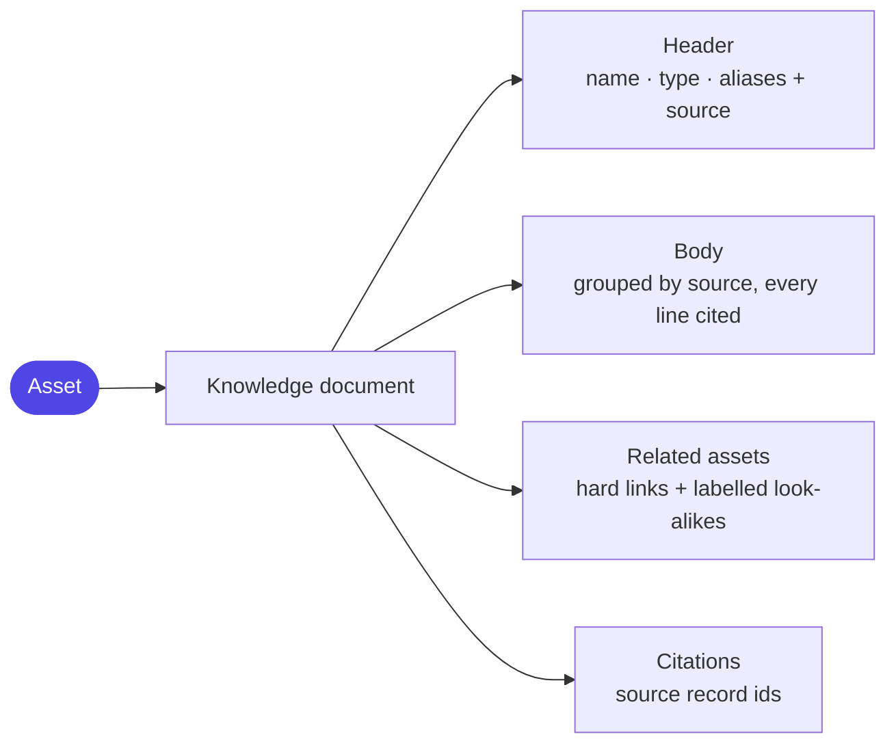

> **New here - OKF (Open Knowledge Format).** A simple convention - a markdown file
> with a small structured header - that originated as a public specification for
> sharing knowledge between tools. Atlas uses it only as a readable, portable *view*
> built on demand from the database, never as a second place data is stored.

> **Why this way.** The same document serves three readers at once: a person in the
> UI, a search step that indexes it, and an audit trail that shows where each fact
> came from.

---

## Layer 8 - Retrieval

A question is answered from evidence, not memory. Three searches run in parallel,
their rankings are fused, and the top matches are re-scored before anything reaches
the model.

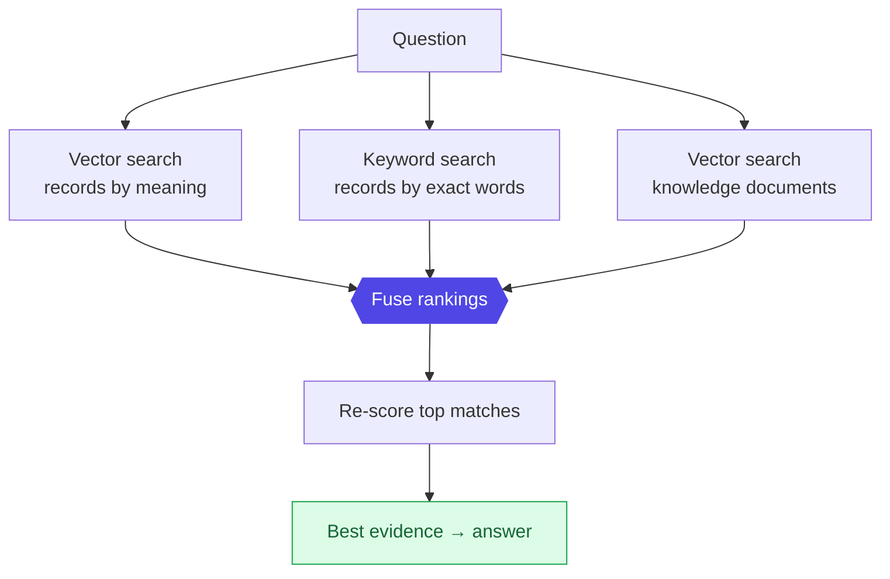

> **Why three, then two more steps.** Meaning-search finds paraphrases;
> keyword-search catches exact ids and codes; searching the knowledge documents pulls
> in already-consolidated context. Fusing all three recovers matches any single
> method misses.

> **New here.** *Reciprocal Rank Fusion* blends several ranked lists by rank position,
> so no list needs a hand-tuned weight. *Cross-encoder re-scoring* reads the question
> and a candidate together and judges the pair directly - slower, so it runs only on
> the short list, buying precision at the top. Both vector search and keyword search
> run inside the one PostgreSQL database (vectors via its `pgvector` extension,
> keywords via its built-in full-text index).

---

## Layer 9 - Ask copilot

The chat is a router, not a free-roaming agent. Each question is sent to one handler,
so every answer stays grounded and the number of model calls per turn stays fixed.

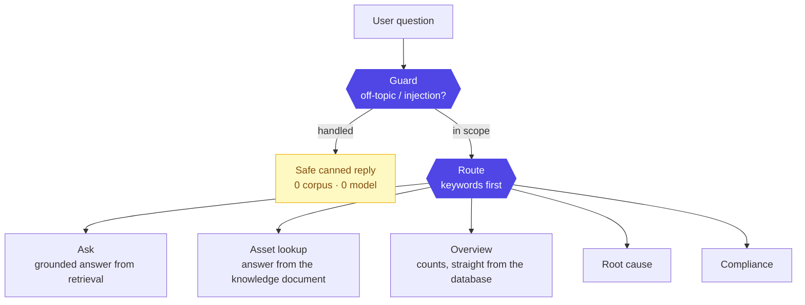

An off-topic question or a prompt-injection attempt is caught by a deterministic
guard first and answered with a safe canned reply - it never reaches the corpus or a
model. Two more things are computed, not asked of the model, so they cannot be
hallucinated: the **confidence** of an answer and any **contradicting evidence**,
which is always surfaced. The answer streams as it is written, and the model's
reasoning streams separately from its final wording, so the interface can show a
"thinking" trace above a clean answer, with a stop button.

> **New here - LangGraph.** A library for laying out language-model steps as an
> explicit graph of stages. It is used so the route and each handler are inspectable
> and testable, rather than one opaque prompt. Simple counts never touch a model at
> all.

---

## Layer 10 - Root-cause analysis

Four stages. Evidence is gathered from the graph first; the model reasons only when
real failure evidence exists, so it can never invent a cause for a healthy asset.

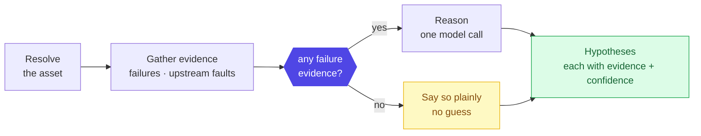

> **Worked example - multi-hop.** Diagnosing the database server `ua-0003` returns
> ranked hypotheses: a failing disk drive (rising SMART reallocated sectors, disk I/O
> wait), memory exhaustion (near-zero free memory, OOM events), and - crucially -
> packet loss traced not to the server but to the core switch `ua-0005` it depends on
> (uplink port flapping, CRC errors). The upstream record is cited. The memory root
> cause (software leak vs hardware) is kept listed as unresolved rather than guessed.

> **Why this way.** No failures on record means nothing to diagnose; the gate stops a
> confident-sounding story with no basis. Following the depends-on link is what lets a
> downstream symptom be attributed to an upstream fault.

> **Grounded scoring.** Each hypothesis's confidence is calibrated to its evidence,
> not left to the model: a hypothesis whose cited record actually exists scores
> higher, a resolving upstream cause raises it further, and contradictions pull it
> down - so an ungrounded guess cannot score high.

---

## Layer 11 - Compliance

Same four-stage shape, with one deliberate difference: the at-risk list is computed
by a database query and is the source of truth. The model only writes the summary.

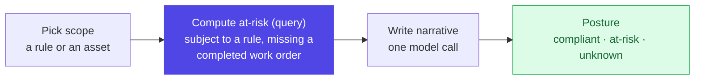

> **Worked example.** For rule `RULE-PATCH-Q`, the query flags asset `ua-0004` as at
> risk (subject to the rule with no completed work order), while `ua-0003` is linked
> to the rule but clear. The model writes the wording around that fact; it cannot add
> or remove an asset from the list.

> **Why this way.** "Which assets are at risk" is an audit answer - it must be exact
> and repeatable, so it comes from a query, never from generated text.

---

## Layer 12 - The data model

Everything rests on one PostgreSQL database. Source records are durable ground truth
(never overwritten); derived tables are rebuilt on each ingest.

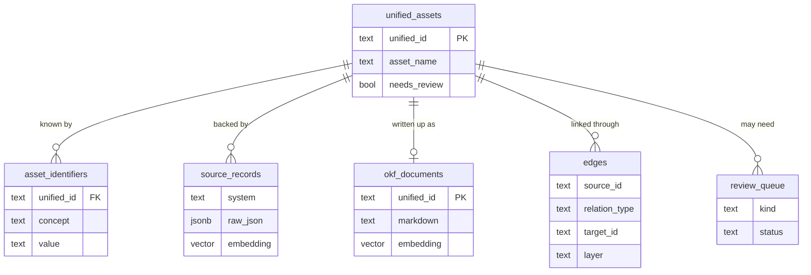

> **New here - `pgvector`.** A PostgreSQL extension that adds a vector column type and
> similarity search, so embeddings live beside the records instead of in a separate
> service. `source_records.embedding` powers meaning-search; `edges.layer` splits the
> graph into physical and operational.

---

## Layer 13 - End to end

Two flows connect every layer above - data in, and answer out - both streamed.

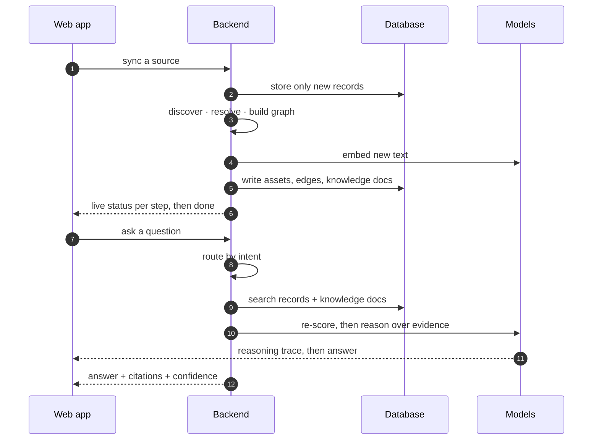

> **New here - Server-Sent Events (SSE).** A one-way stream over ordinary HTTP where
> the server pushes messages as they happen. It is used so each step's status and each
> token of an answer appear immediately, with no polling and no two-way socket to
> manage. Perceived speed comes from streaming: first words appear almost at once.

---

## The stack, at a glance

Each tool was introduced above at the layer that uses it. Summary for reference:

| Layer | Tool | Role |
|-------|------|------|
| Web app | Vite + React + TypeScript, Tailwind + shadcn/ui | single-page UI |
| Graph view | d3-force-3d (custom canvas) | interactive knowledge graph |
| Backend | Python 3.13, FastAPI (async) | API + orchestration host |
| Workflows | LangChain + LangGraph, LangSmith tracing | inspectable multi-step reasoning |
| Database | PostgreSQL (Supabase) + `pgvector` + full-text | one store: records, vectors, graph, docs |
| Models | NVIDIA NIM - MoE chat model, small model (two tiers), embeddings, reranker | reasoning, extraction, search |
| Documents | Docling (IBM Research · LF AI & Data) | parse PDFs into structured, gen-AI-ready content before any model |
| Transport | Server-Sent Events | live status + streamed answers |
| Rate control | one shared token bucket | stay inside the model request budget |

---

## The hard parts (and the decisions behind them)

1. **Resolving without a shared key.** Merge records that mean the same asset, never
   merge ones that don't, and don't flood reviewers. Solved with strongest-first
   union-find, an explainable score, and a bridge-conflict guard that only escalates a
   pair when it genuinely shares a strong id.
2. **A graph without a graph database.** Fixed, shallow traversals don't justify a
   second engine. One edges table, recursive SQL, multi-hop via depends-on. One source
   of truth, one thing to operate. (A dedicated graph database was evaluated and
   rejected for this reason.)
3. **Grounding against hallucination.** The model reasons only when evidence exists;
   confidence, at-risk lists, and counts are computed in SQL; identifiers are quoted
   verbatim; contradictions and unknowns are surfaced.
4. **Staying fast inside a strict request budget.** Stream instead of block; one
   shared limiter across all model calls; only new records embedded; two model tiers -
   reasoning where it matters, a fast tier for high-volume extraction.
5. **Cross-industry robustness.** No hardcoded field names; routine records are not
   turned into failures (deterministic vocabulary first, the model only as a
   tie-breaker); prompts kept domain-neutral.

> **The through-line.** Keep one source of truth, compute what must be exact, let the
> model do only what models are good at, and make every answer traceable. That is what
> makes Atlas both fast and trustworthy.
